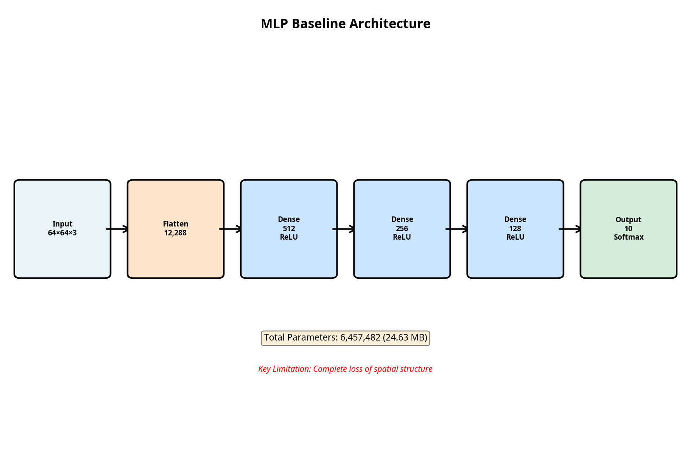
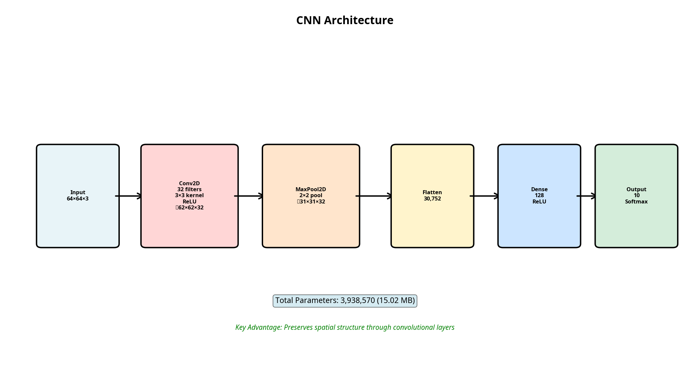

## 1. Problem Description

This laboratory addresses a **multi-class image classification** problem using the CIFAR-10 dataset. The main objective is to compare the performance of two fundamentally different neural network architectures:

1.  A **Dense Neural Network (MLP)**, which serves as a non-convolutional baseline model.
2.  A **Convolutional Neural Network (CNN)**, specifically designed for computer vision tasks.

The purpose is to empirically demonstrate why convolutional architectures are superior for tasks involving data with spatial structure, such as images, and to analyze the inherent limitations of dense models in this context.

## 2. Dataset Description

-   **Name**: CIFAR-10
-   **Source**: Loaded via `tensorflow_datasets`.
-   **Content**: 60,000 low-resolution (32×32 pixels) color images.
-   **Classes**: 10 mutually exclusive classes: `airplane`, `automobile`, `bird`, `cat`, `deer`, `dog`, `frog`, `horse`, `ship`, `truck`.
-   **Distribution**: The dataset is perfectly balanced, meaning each class has the same number of samples:
    -   **Training Set**: 50,000 images (5,000 per class).
    -   **Test Set**: 10,000 images (1,000 per class).
-   **Preprocessing**: For the experiments, the images were resized to 64×64 pixels, and their pixel values were normalized to the `[0, 1]` range.

## 3. Implemented Architectures

Two models with different architectures were implemented and evaluated.

### 3.1. Model 1: Dense Neural Network (MLP) - Baseline

This model serves as a reference point. Its design flattens the input image into a single vector, losing all spatial information.

-   **Input Layer**: The 64×64×3 images are flattened into a vector of 12,288 features.
-   **Hidden Layers**: Three dense layers with ReLU activation (512, 256, and 128 neurons) to learn non-linear relationships.
-   **Output Layer**: A dense layer with 10 neurons and Softmax activation to produce a probability distribution over the 10 classes.
-   **Total Parameters**: 6,457,482.

### 3.2. Model 2: Convolutional Neural Network (CNN)

This architecture is designed to preserve and exploit the spatial structure of the images by using convolutional and pooling layers.

-   **Convolutional Layer**: A `Conv2D` layer with 32 3×3 filters and ReLU activation. It learns to detect local features like edges and textures.
-   **Pooling Layer**: A `MaxPooling2D` layer that reduces the spatial dimensionality (from 62×62 to 31×31), making the representation more manageable and robust to small translations.
-   **Flatten Layer**: Converts the output of the convolutional block into a vector for the dense layers.
-   **Dense Layers**: A hidden layer of 128 neurons (ReLU) and the 10-neuron Softmax output layer.
-   **Total Parameters**: 3,938,570 (significantly fewer than the MLP).

## 4. Experiment Results

Both models were trained for 20 epochs. The following table provides a comparative summary of the final results.

| Metric | MLP Model (Baseline) | CNN Model | Interpretation |
| :--- | :--- | :--- | :--- |
| **Accuracy (Training)** | 55.70% | **89.57%** | The CNN learns the features of the training set much better. |
| **Accuracy (Validation/Test)** | 47.79% | **~57.02%** | The CNN generalizes better to unseen data, outperforming the MLP by ~10%. |
| **Loss (Training)** | 1.2404 | **0.3170** | The CNN's training error is much lower, indicating a better fit. |
| **Loss (Test)** | 1.4834 | 1.8955 | Although the CNN has a higher test loss, its accuracy is superior. |
| **Overfitting** | Moderate (~8% gap) | **Severe (~32% gap)** | The CNN, being more powerful, memorizes the training data if not regularized. |
| **Parameters** | 6.5 Million | **3.9 Million** | The CNN is much more parameter-efficient. |

## 5. Interpretation and Conclusions

1.  **Fundamental Limitation of the MLP**: The MLP model, despite having more parameters, stagnates at a lower performance (~48% accuracy). This is because the `Flatten` layer destroys the spatial structure of the image, treating pixels as independent features. The model cannot learn concepts like "an eye is next to a nose."

2.  **Advantage of the CNN**: The simple CNN, although basic, outperforms the MLP with ~57% validation accuracy. Its `Conv2D` layer acts as a feature detector that slides over the image, preserving spatial relationships. The `MaxPooling2D` layer helps make these features more robust.

3.  **Efficiency and Overfitting**: The CNN achieves better performance with 40% fewer parameters. This demonstrates the efficiency of weight sharing in convolutional layers. However, its greater learning capacity makes it prone to severe overfitting, as shown by the large gap between training (89%) and validation (57%) accuracy.

**Final Conclusion**: The experiments clearly show that convolutional architectures are indispensable for computer vision tasks. An MLP is not a suitable tool for this type of problem. Although the simple CNN implemented is superior, it suffers from severe overfitting, indicating that the logical next steps would be to improve its architecture (by adding more layers) and introduce regularization techniques such as **Dropout** and **data augmentation** to enhance its generalization ability.
